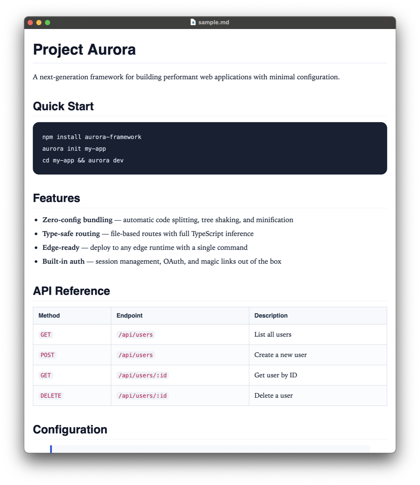
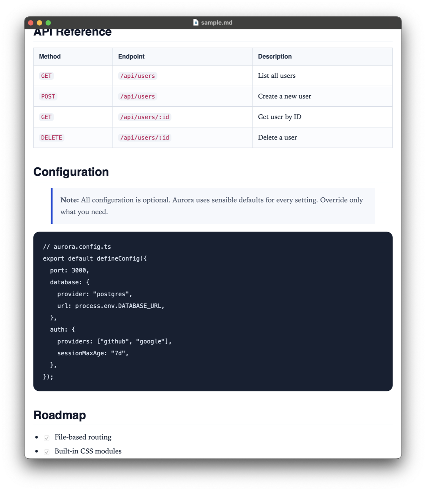

<p align="center">
  
</p>

<h1 align="center">MDviewer</h1>

<p align="center">
  Open any Markdown file as a clean, print-ready document. Export to PDF in one click.
</p>

<p align="center">
  <a href="https://github.com/JackYoung27/mdviewer/releases/latest">Download for macOS</a>
  &nbsp;&middot;&nbsp;
  <a href="#screenshots">Screenshots</a>
  &nbsp;&middot;&nbsp;
  <a href="#features">Features</a>
</p>

---

<!-- TODO: Replace with actual screenshot -->
<!-- <p align="center">
  
</p> -->

## Why MDviewer

Most Markdown preview options are either heavyweight editors (Obsidian, Typora), terminal pipelines (`pandoc | chrome`), or raw browser tabs with no print layout. MDviewer does one thing: **opens `.md` files and makes them look good on screen and on paper.**

- Double-click a `.md` file in Finder and it just opens
- Print or export to PDF with the layout you actually see
- No Electron. No Node runtime. Native Cocoa + WebKit, under 1 MB

## Features

- **Native macOS app** — Cocoa + WKWebView, launches instantly
- **Print-friendly typography** — serif body text, clean headings, proper spacing
- **PDF export** — `Cmd+Shift+E` saves to PDF; `Cmd+P` prints directly
- **Secure rendering** — HTML is sanitized with [DOMPurify](https://github.com/cure53/DOMPurify) and locked down with Content Security Policy
- **GitHub Flavored Markdown** — tables, task lists, fenced code blocks, line breaks
- **Default handler registration** — install once, and `.md` files open in MDviewer from Finder
- **Tabbed windows** — open multiple documents in a single window
- **Reload** — `Cmd+R` re-renders after you edit the source file
- **Local-first** — no network calls, no telemetry, no accounts

## Install

### Download (recommended)

1. Go to [**Releases**](https://github.com/JackYoung27/mdviewer/releases/latest)
2. Download `Markdown.Viewer.app.zip`
3. Unzip and drag to `/Applications`
4. On first launch: right-click the app → **Open** (required once for unsigned apps)

### Build from source

```bash
git clone https://github.com/JackYoung27/mdviewer.git
cd mdviewer
./build.sh
```

The built app is at `dist/Markdown Viewer.app`. To install to `/Applications` and register as the default Markdown handler:

```bash
./install.sh
```

**Requirements:** macOS with Xcode Command Line Tools (`xcode-select --install`).

## Keyboard Shortcuts

| Action | Shortcut |
|---|---|
| Open file | `Cmd+O` |
| Reload preview | `Cmd+R` |
| Print | `Cmd+P` |
| Export as PDF | `Cmd+Shift+E` |
| Close window | `Cmd+W` |

## Screenshots

<!-- TODO: Add actual screenshots -->
<!--
| Document view | PDF export | Code blocks |
|---|---|---|
|  |  |  |
-->

*Screenshots coming soon — see [asset checklist](#asset-production-checklist) below.*

## How It Compares

| | MDviewer | Obsidian | Typora | Pandoc + browser | GitHub.com |
|---|---|---|---|---|---|
| Opens from Finder double-click | Yes | No | Yes | No | No |
| Print-ready layout | Yes | No | Partial | Manual CSS | No |
| PDF export | Built-in | Plugin | Built-in | CLI | No |
| App size | < 1 MB | ~500 MB | ~90 MB | ~200 MB | N/A |
| Electron-free | Yes | No | No | N/A | N/A |
| Free & open source | MIT | Freemium | Paid | MIT | Proprietary |
| Edits Markdown | No | Yes | Yes | No | Yes |

MDviewer is **not** an editor. If you need to write Markdown, use your favorite text editor and preview with MDviewer.

## How It Works

1. A shell script reads the `.md` file, base64-encodes it, and embeds it in a self-contained HTML page
2. The HTML page loads [marked](https://github.com/markedjs/marked) (GFM parser) and [DOMPurify](https://github.com/cure53/DOMPurify) (XSS sanitizer) from vendored bundles with SHA-256 verification
3. A native Cocoa app displays the HTML in WKWebView with a strict Content Security Policy
4. PDF export uses WebKit's native PDF rendering — what you see is what you get

## License

[MIT](./LICENSE)
